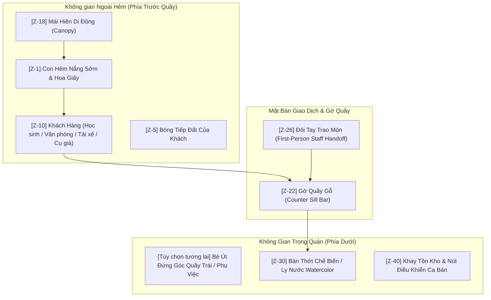

# XÓM NHỎ — TÀI LIỆU QUY CÁCH VÀ STORYBOARD ASSET PILOT

> **Phiên bản**: v0.7.3-pilot  
> **Ngày lập**: 01/10/2026  
> **Mục tiêu**: Định hình quy chuẩn cho đợt thử nghiệm Pilot (4 Khách vãng lai + 1 Mái che + 1 Handoff mẫu + Storyboard nhân sự) trước khi nhân rộng sản xuất hàng loạt.

---

## 1. STORYBOARD & ĐỊNH VỊ KHÔNG GIAN NHÂN SỰ QUÁN (STAFF PLACEMENT)

### 1.1. Bối cảnh không gian và thách thức góc nhìn
- **Góc nhìn hiện tại của màn SHOP (Street Counter Window)**:
  - Máy quay đặt **bên trong quầy nhìn ra ngoài hẻm** (First-Person / Vendor POV).
  - Khung trên (`.street-counter-scene` cao 260px): Thấy con hẻm rợp hoa giấy, nền đá, nắng sớm, mái hiên và khách hàng bước đến trước mặt quầy.
  - Gờ quầy gỗ (`.counter-sill-bar` cao 18px): Ranh giới vật lý giữa trong quán và ngoài đường.
  - Khung dưới (`.auto-prep-bench` chiếm ~45% màn hình): Thớt gỗ chế biến bánh mì và khay pha chế đồ uống.
- **Rủi ro thiết kế nếu đặt sprite toàn thân Nhâm / Bé Út vào khung cảnh**:
  - Nếu vẽ Nhâm đứng phía sau quầy gỗ ở ngoài hẻm: Nhâm sẽ trông như một người khách đứng ngoài đường nhìn vào trong quán, gây mâu thuẫn nhận thức (cognitive dissonance).
  - Nếu vẽ Nhâm đứng ở góc dưới: Sprite sẽ che mất thớt cắt bánh mì, khay nguyên liệu hoặc che khuất khách hàng đứng đối diện.

### 1.2. Giải pháp Storyboard: First-Person Hands POV + Side Assistant
Hệ thống nhân sự quán được phân lớp thành 2 thành phần độc lập:

#### A. Chủ quán Nhâm (Góc nhìn First-Person POV)
- **Hình thức thể hiện**: Đôi cánh tay của Nhâm (áo thun xắn tay gọn gàng, tạp dề mộc).
- **Trạng thái chuyển động (States)**:
  1. `prep_cutting`: Đôi tay cầm dao cắt đôi ổ bánh mì giòn trên thớt gỗ.
  2. `prep_filling`: Đôi tay gắp chả lụa, chan sốt, rắc dưa ngò.
  3. `prep_drink`: Đôi tay xúc đá viên, vắt tắc tươi, rót sữa đậu.
  4. `handoff`: Đôi tay cầm ổ bánh mì bọc giấy kraft buộc thun đỏ vươn qua gờ quầy gỗ (`counter-sill-bar`) trao tận tay khách hàng.
- **Ưu điểm**:
  - Tỷ lệ tương tác 1:1 đem lại cảm giác nhập vai (tactile immersion) cao như *Coffee Talk* hay *Good Pizza, Great Pizza*.
  - Hoàn toàn không che khuất khách hàng đứng ngoài quầy và không choán diện tích bàn chế biến.

#### B. Bé Út (Phụ việc quầy — Mở khóa khi nâng cấp quy mô quán)
- **Hình thức thể hiện**: Đứng ở góc quầy bên trái (Left-hand sill profile), góc nhìn nghiêng 3/4 nhìn hướng ra hẻm.
- **Vai trò**: Phụ xếp bao mang đi, phụ bê khay nước ra ghế cóc khi khách chọn ngồi lại.
- **Vị trí**: X = 10px, Y = 160px (chỉ chiếm 15% bề ngang bên trái, mắt hướng về phía khách).

---

## 2. QUY CÁCH 4 NHÂN VẬT KHÁCH PILOT (1 CHO MỖI ARCHETYPE)

Tất cả 4 nhân vật được thiết kế chuẩn theo phong cách Watercolor Storybook Nam Bộ của `co_chin_standing.png`:
- Kích thước canvas gốc: $848 \times 1264$ px, tỉ lệ $2:3$, kênh màu RGBA (nền trong suốt đã lọc viền mềm anti-aliasing).
- Chiều cao hiển thị trong viewport mobile 390×844: $175 - 180$ px.
- Tách biệt dữ liệu: `personId`, `name`, `visualVariantId`, `clothing`, `expression` hoàn toàn độc lập trong mã nguồn.

| Mã Variant | Archetype | Nhân vật Pilot | Trang phục & Phụ kiện đặc trưng | File Asset |
| :--- | :--- | :--- | :--- | :--- |
| `walkin_variant_0` | `teen` | **Em Nam (Học sinh)** | Áo sơ mi trắng đồng phục học sinh, quần tây xanh đen, dép quai hậu, đeo ba lô một bên vai. Nét mặt tươi cười rụt rè, chuẩn bị vào lớp. | `assets/pilot/walkin_student.png` |
| `walkin_variant_1` | `adult_average` | **Chị Mai (Văn phòng)** | Áo sơ mi ngắn tay xanh pastel, chân váy màu be thanh lịch, đeo thẻ nhân viên công sở trước ngực, xách túi vải canvas đựng ly giữ nhiệt. | `assets/pilot/walkin_office.png` |
| `walkin_variant_2` | `adult_tall` | **Chú Bảy (Tài xế công nghệ)** | Áo khoác gió màu xanh lá có vạch phản quang, quần jean bạc màu, nón bảo hiểm nửa đầu chưa gài quai, khăn bông vắt qua cổ, tay cầm điện thoại. | `assets/pilot/walkin_driver.png` |
| `walkin_variant_3` | `elder_short` | **Bác Năm (Tập thể dục)** | Áo sơ mi cộc tay cotton hoa văn chìm mát mẻ, quần đũi xám, dép lào, tay cầm quạt nan phe phẩy thong thả. Nét mặt đôn hậu, tóc hoa râm. | `assets/pilot/walkin_elder.png` |

---

## 3. QUY CÁCH MÁI CHE NÂNG CẤP (CANOPY AWNING PILOT)

- **Phong cách**: Mái hiên di động sọc xanh lá - trắng kem kinh điển của các quán ăn vỉa hè Sài Gòn / miền Nam.
- **Kích thước file**: $1282 \times 448$ px RGBA (đã crop gọn sát viền bạt, không chứa khoảng trống thừa).
- **Vị trí gắn trong Scene**:
  - Gắn tại mép trên cùng của khung cửa sổ quầy (`top: 0; left: 0; width: 100%; height: 64px`).
  - Lớp hiển thị: Z-index 18 (nằm trên cảnh nền ngõ hẻm z=1, dưới gờ quầy z=22 và tay giao món z=26).
  - Đổ bóng nhẹ (`drop-shadow: 0 4px 8px rgba(0, 0, 0, 0.4)`) xuống lòng hẻm phía dưới.
- **Tính năng Gameplay**:
  - Ban đầu quán mộc chưa có mái che (`upgrades.canopy = 0`).
  - Khi mở khóa nâng cấp Mái Hiên (`upgrades.canopy = 1`), mái bạt lập tức xuất hiện che mát cho quầy, giúp tăng lượng khách ghé quán vào những ngày nắng gắt hoặc mưa rào.

---

## 4. QUY CÁCH ĐỘNG TÁC TRAO MÓN (STAFF HANDOFF PILOT)

- **Phong cách**: Đôi tay người phục vụ vươn qua mặt quầy gỗ đưa thức ăn nóng hổi đến tay khách.
- **Kích thước file**: $1200 \times 896$ px RGBA, hiển thị ở chiều rộng $210$ px trên điện thoại.
- **Bao bì thể hiện**: Ổ bánh mì giòn được gói gọn trong túi giấy kraft nâu mộc mạc, buộc sợi thun đỏ quanh thân bánh đúng phong cách bánh mì truyền thống Việt Nam (không in chữ cố định để người chơi tự do đặt tên quán).
- **Kích hoạt (Trigger)**: Xuất hiện tự động khi khâu chế biến hoàn tất (`autoPrepState.stage === 'done'`) và khách hàng nói lời cảm ơn kèm hiệu ứng lấp lánh `✨`.
